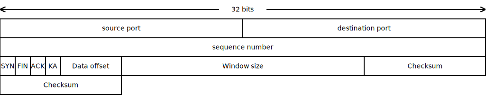

# PIKT 2024 Custom Protocol over UDP

## Goal of the project

Design and implement a P2P application using a proprietary protocol built on top of UDP (User Datagram Protocol) in the transport layer of the TCP/IP network model.

## Key Features of protocol:

1. **Connection-Oriented**: Protocol establishes a reliable connection between a client and a server before transmitting data.
2. **Reliable Delivery**: Protocol ensures that all data reaches the receiver in the correct order and without errors.
3. **Flow Control**: Protocol manages data transmission so that a fast sender doesn't overwhelm a slow receiver.

## How does it work

### 1. Three-Way Handshake (Connection Establishment)
The protocol uses a **three-way handshake** to establish a reliable connection between the sender and receiver:

- **Step 1**: The client sends a SYN (Synchronize) packet to the server, indicating it wants to establish a connection.
- **Step 2**: The server responds with a SYN-ACK (Synchronize-Acknowledgment) it means that both SYN and ACK flags are enable, confirming the request.
- **Step 3**: The client sends an ACK (Acknowledgment) back to the server, completing the handshake.

### 2. Data Transfer
Each packet of data is numbered with a **sequence number**. The receiver acknowledges each successful data reception with the same packet, and ACK flag 1. If acknowledgement wasn't received sender will repeat the packet.

These are mechanisms which ensures reliability:
- **Error checking** using checksums to verify data integrity.
- **Retransmission** of lost or corrupted packets.
- **Sliding window** to manage the amount of data sent without acknowledgment.

### 3. Flow Control (Window Size)
Protocol uses a **window size** mechanism to control the flow of data. The window size is advertised by the receiver and tells the sender how many bytes it can send before receiving an acknowledgment. As the receiver processes the data and acknowledges it, the window "slides", allowing more data to be sent.

### 4, Keep Alive (KIP flag)
Protocal uses a **keep alive** mechanism to ensure that the connection is still active. It sends a packet with a KIP flag, in case of getting a response, it continues data flow, in case keep alive packet is ignored three time, the connection will be terminated.

### 5. Four-Way Handshake (Connection Termination)
When either one of speakers decide to terminate the connection, a **four-way handshake** is used to close the connection:

- **Step 1**: The client sends a FIN (Finish) packet to indicate it's done sending data.
- **Step 2**: The server acknowledges the FIN with an ACK.
- **Step 3**: The server then sends its own FIN to the client.
- **Step 4**: The client acknowledges the server’s FIN with an ACK, and the connection is closed.

## Protocol Fields and Diagram

### 1. **Source Port (16 bits)**:
   Identifies the port of the sending application.
   
### 2. **Destination Port (16 bits)**:
   Identifies the port of the receiving application.
   
### 3. **Sequence Number (32 bits)**:
   Identifies the position of the packet in overal data stream.

### 4. **Data Offset (4 bits)**:
   Specifies the length of the the header in 32-bit words.

### 5. **Flags (4 bits)**:
   Control bits SYN, ACK, FIN, KIP, which indicate the purpose of the packet.

### 6. **Window Size (16 bits)**:
   Used for flow control, indicating how many packets the receiver can accept.

### 7. **Checksum (16 bits)**:
   Used to verify correctness of a packet.

### 8. **Retransmission**
   Packet is sent back immediately after timeout of absence of an acknowledgment message.

## Flags

1. **SYN (Synchronize)**: Initiates a connection.
2. **ACK (Acknowledgment)**: Acknowledges received data.
3. **FIN (Finish)**: Indicates that a sender has finished transmitting.
4. **KEEP (Keep alive)**: Indicates a keep alive packet.

# CHANGES DURING IMPLEMENTATION
## 1. ACKs packet id 
ACKs packet id is packet id of a packet * -1(Because of priority messages with id less then -1)

## 2. Added new flags 
5. **ACK2 (Acknowledgment2)**: Acknowledgment for handshake.
6. **FILE (File)**: Indicates that the type of message is a file.
7. **END (End)**: Indicates the end of a message

## 3. Messages
Added division into messages, several messages can be sent simultaneously. Added message_id to header.

## 4. Screenshoots
